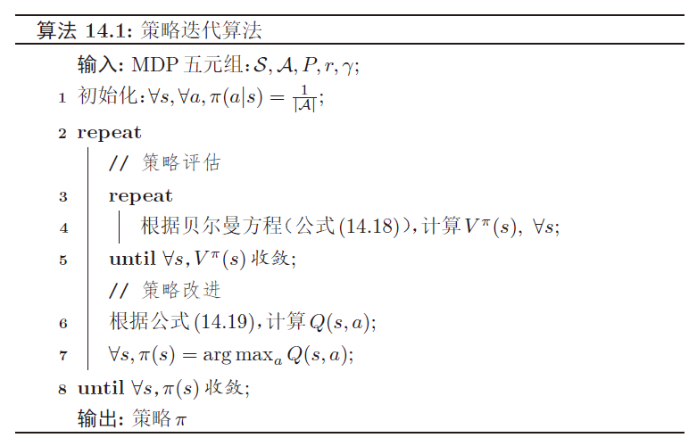
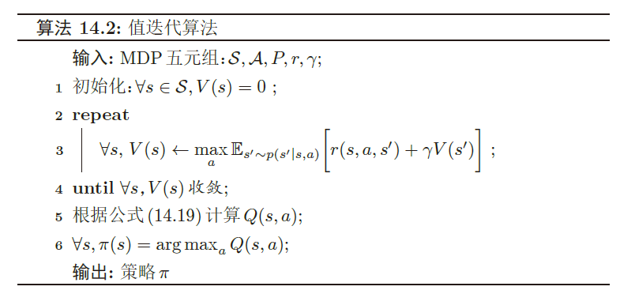
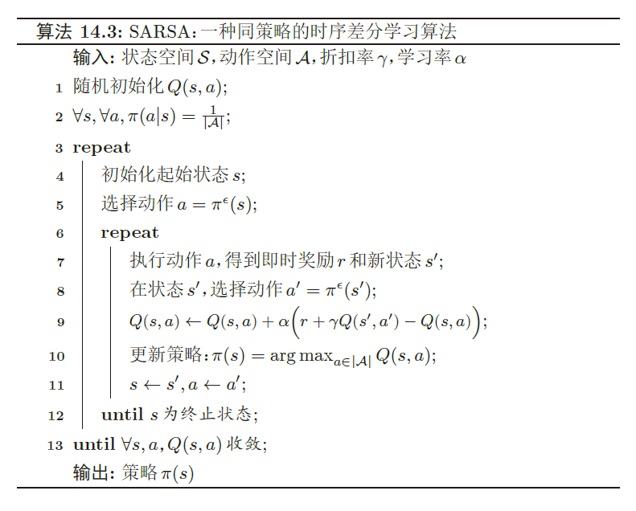
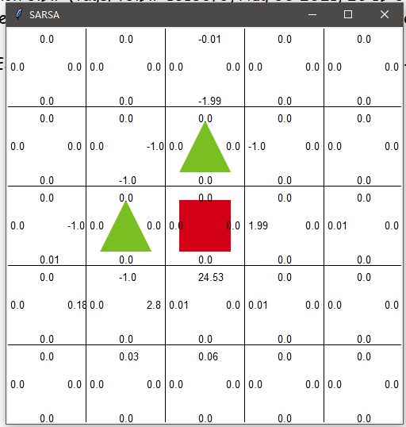
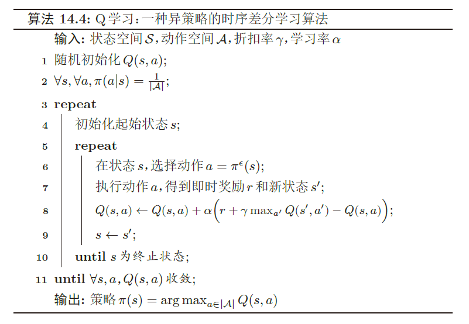
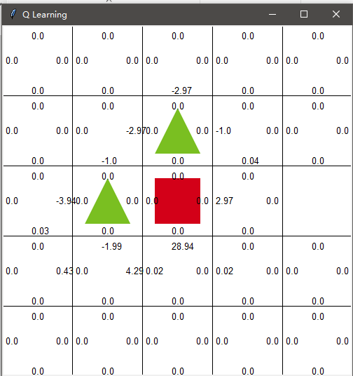
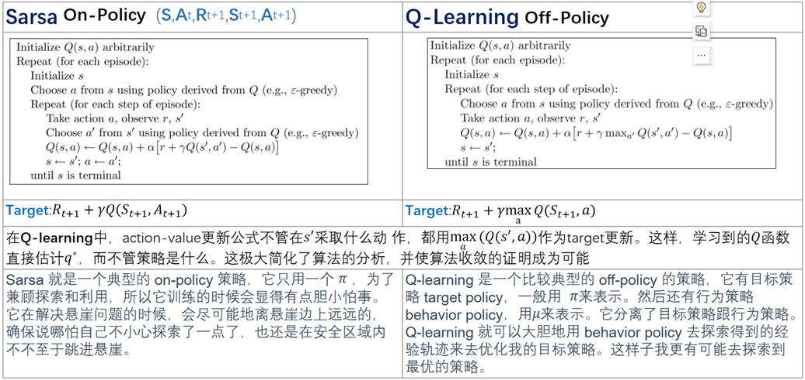

<script src="https://cdnjs.cloudflare.com/ajax/libs/mathjax/2.7.7/latest.js?config=TeX-MML-AM_CHTML-full,Safe"> </script>
<!-- MathJax configuration -->
<script type="text/x-mathjax-config">
    init_mathjax = function() {
        if (window.MathJax) {
        // MathJax loaded
            MathJax.Hub.Config({
                TeX: {
                    equationNumbers: {
                    autoNumber: "AMS",
                    useLabelIds: true
                    }
                },
                tex2jax: {
                    inlineMath: [ ['$','$'], ["\\(","\\)"] ],
                    displayMath: [ ['$$','$$'], ["\\[","\\]"] ],
                    processEscapes: true,
                    processEnvironments: true
                },
                displayAlign: 'center',
                CommonHTML: {
                    linebreaks: { 
                    automatic: true 
                    }
                },
                "HTML-CSS": {
                    linebreaks: { 
                    automatic: true 
                    }
                }
            });
        
            MathJax.Hub.Queue(["Typeset", MathJax.Hub]);
        }
    }
    init_mathjax();
</script>
[**强化学习**](https://nndl.github.io/)（Reinforcement Learning，RL），**增强学习**，指一类从（与环境）交互中不断学习的问题以及解决这类问题的方法。

<br/>

## 一些定义

|名词|含义|
|--|--|
|**智能体**（Agent）|感知外界环境的状态和反馈的奖励，并进行学习和决策的对象。|
|**环境**（Environment）|智能体外部的所有事物，受智能体动作影响而改变其状态，并反馈给智能体相应奖励。|

上述二者对象进行交互。

### 基本要素

|名称|描述|
|--|--|
|**状态*s***|对环境的描述，可离散可连续，状态空间为S|
|**动作*a***|智能体行为的描述，可离散可连续，动作空间为A|
|**策略*π(a/s)***|智能体根据环境状态s决定下一步动作a的函数，可分成两类，确定性策略和随机性策略，前者是状态空间到动作空间的映射函数π:S→A；后者是给定环境状态时，选择动作的概率分布；一般采取后者|
|**状态转移概率*P(s'/s,a)***|智能体根据当前状态s和做出动作a之后，环境在下一个时刻变换为状态s’的概率|
|**即时奖励*r(s,a,s')***|标量函数，智能体根据当前状态s做出动作a后，环境反馈给智能体一个奖励，这个奖励常和下个时刻状态s'有关|

强化学习任务中有两个非常重要的概念——**开发**（exploit）和**探索**（explore），有时也分别叫做**利用**和**试探**。

- 开发：在强化学习中，开发指智能体在已知的所有（状态-动作）二元组分布中，本着“最大化动作价值”的原则选择最优的动作。换句话说，当智能体从已知的动作中进行选择时，我们称此为开发（或利用）；
- 探索：指智能体在已知的（状态-动作）二元组分布之外，选择其他未知的动作。

## K臂赌博机问题

为了保证探索性，采用ε-greedy策略：每次选择动作，以一个小概率ε<1随机选择一个动作，而不是总按照最大原则。ε-greedy可以保证所有的$Q_{t}(a)$收敛到$q_*(a)$。选择最优动作的概率可以随着时间推进而逐渐提高，或者说ε逐渐降低。

$$\pi^{\epsilon}(s)=\left\{\begin{aligned}\pi(s), 按概率1-\epsilon\\随机选择A中的动作,按概率\epsilon
\end{aligned}
\right.$$

## 马尔可夫决策过程

智能体和环境交互过程可以看作一个**马尔可夫决策过程**。（MDP）

**马尔科夫链**：**离散时间**的马尔可夫过程。[三要素](https://www.bilibili.com/video/BV19b4y127oZ?from=search&seid=16171659327706364865&spm_id_from=333.337.0.0)为

1. 状态空间  S
2. 无记忆性 $P(s_{t+1}|s_{t},…,s_{0})=P(s_{t+1}|s_{t})$，下时刻状态只取决于当前状态
3. 转移（概率）矩阵

- 给定策略π(a|s)，马尔可夫决策过程的一个轨迹$\tau=s_{0},a_{0},s_{1},r_{1},a_{1},…,s_{T-1},a_{T-1},s_{T},r_{T}$，其概率为$P(\tau)=P(s_{0},a_{0},s_{1},a_{1},…)=P(s_{0})\prod\limits_{t=0}^{T-1}\pi(a_{t}|s_{t})P(s_{t+1}|s_{t},a_{t})$
- $P(A|B)\times P(C|A,B) = P(A,C|B) \to P(a_{t},s_{t+1}|s_{t})$

## 强化学习目标函数

### 总回报

$G(\tau)=\sum\limits_{t=0}^{T-1}r_{t+1}=\sum\limits_{t=0}^{T-1}r(s_{t},a_{t},s_{t+1})$

如果环境没有终止状态（比如终生学习的机器人），即$T=\infin$，其总回报也可能是无穷大，因此引入一个**折扣率**，降低远期回报的权重。

### 折扣回报

$G(\tau)=\sum\limits_{t=0}^{T-1}\gamma^{t}r_{t+1}$

其中$\gamma\in[0,1]$为折扣率。γ接近于0，智能体更在意短期回报，而当γ接近于1，长期回报变得更重要。  

### 目标函数

强化学习的目标是学习到一个策略$\pi_{\theta}(a|s)$，以最大化期望回报。

$J(\theta)=\mathbb{E}_{\tau\sim P_{\theta}(\tau)}[G(\tau)]=\mathbb{E}_{\tau\sim P_{\theta}(\tau)}[\sum\limits_{t=0}^{T-1}\gamma^{t}r_{t+1}]$，其中θ是策略函数的参数。

## 值函数

### 状态值函数

<br/>

$$\mathbb{E}_{\tau\sim P(\tau)}[G(\tau)]=     \mathbb{E}_{\tau\sim P(s_{0})}    [\mathbb{E} _{\tau\sim P(\tau)}  [\sum\limits_{t=0}^{T-1}\gamma^{t}r_{t+1}|\tau_{s_{0}}=s]]=\mathbb{E}_{\tau\sim P(s_{0})}[V^{\pi}(s)]$$

其中$V^{\pi}(s)$称为状态值函数，**表示从s状态开始执行策略π**得到的期望总回报。

### 对于式中期望的理解

期望的下标τ服从一个什么分布？
对于随机变量（普通）

$\mathbb{E}X,\mathbb{E}_{X\sim N(\mu,\sigma^{2})}[f(X)]$

而对于a，s与τ来说，期望可以理解为，求出最优的，最合适的轨迹。

### 状态-动作值函数

$$Q^{\pi}(s,a)=\mathbb{E}_{s'\sim P(s'|s,a)}[r(s,a,s')+\gamma V^{\pi}(s')]$$

$$V^{\pi}(s)=\mathbb{E}_{a\sim \pi (a|s)}[Q^{\pi}(s,a)]$$

$$Q^{\pi}(s,a)=\mathbb{E}_{s'\sim P(s'|s,a)}[r(s,a,s')+\gamma\mathbb{E}_{a'\sim \pi(a'|s')}[Q^{\pi}(s',a')]]$$

其中$Q^{\pi}(s,a)$是状态动作值函数，**表示从初始状态s进行动作a，然后执行策略π**得到的期望总回报。

### 贝尔曼方程

$V^{\pi}(s)=\mathbb{E}_{a\sim \pi(a|s)}\mathbb{E}_{s'\sim P(s'|s,a)}[r(s,a,s')+\gamma V^{\pi}(s')]$

$Q^{\pi}(s,a)=\mathbb{E}_{s'\sim P(s'|s,a)}[r(s,a,s')+\gamma\mathbb{E}_{a'\sim \pi(a'|s')}[Q^{\pi}(s',a')]]$

<br/>

**状态值函数**$V^{\pi}(s)$ **是状态-动作值函数**$Q^{\pi}(s,a)$ **关于动作a的期望。**

### 值函数的作用

值函数可以看作是对策略π的评估。

### 优化策略

若在状态s，有一个动作a\*使得$Q^{\pi}(s,a^{*})>V^{\pi}(s)$，说明执行动作a\*的回报比当前策略要高，就可以调整参数让策略中动作a\*概率增大。

### 深度强化学习

由于状态数和动作数越来越复杂，可以设计一个更强大的策略函数如**深度神经网络**。

## 基于值函数的学习方法

 最优策略π*

$\forall s, \pi^{*}=\argmax\limits_{\pi}V^{\pi}(s)$

通常难以实现，因为策略空间为$|A|^{|S|}$往往很大。

### 迭代

$$\pi'(a|s)=\left\{\begin{aligned}1 ,if\ a=\argmax&_{\hat{a}}Q^{\pi}(s,\hat{a})\\0, otherwise
\end{aligned}
\right.$$

> **基于模型的强化学习**（Model-Based）是模型已知的强化学习算法，如动态规划算法，而模型未知，基于采样的学习算法称为**模型无关的强化学习**（Model-Free），如蒙特卡罗方法

### 动态规划

- 策略迭代
  - 策略评估：计算当前策略每个状态值函数
  - 策略改进：根据值函数更新策略



- 值迭代：将策略评估，策略改进合并，直接计算最优策略。



- 两种算法比较：策略迭代算法每次迭代时间**复杂度更大**，而值迭代算法**迭代次数**比策略迭代算法多。

动态规划算法限制：

1. 要求模型已知
2. 效率较低

### 蒙特卡罗

Q函数通过采样进行计算，这就是蒙特卡洛方法。

> 同策略：在蒙特卡洛方法中，如果采样策略是$\pi^{\epsilon}(s)$，不断改进策略也是$\pi^{\epsilon}(s)$而不是$\pi(s)$。这种采样与改进策略相同的学习方法叫同策略（On-Policy）
> 
> 异策略：如果采样策略是$\pi^{\epsilon}(s)$，而优化目标是策略$\pi(s)$，可以通过**重要性采样**，引入**重要性权重**来实现对目标策略的优化这种采样与改进策略不同的学习方法叫异策略（Off-Policy）

### 时序差分学习方法

是蒙特卡洛的一种改进，通过引入动态规划提高学习效率。模拟一段轨迹，每行动一步或几步，就利用贝尔曼方程评估行动前状态的价值。

当时序差分学习方法中每次更新的动作数为最大步数时，就等价于蒙特卡罗方法。

$$\hat Q^{\pi}_{N}(s,a) = \frac{1}{N}\sum\limits^{N}_{n=1}G(\tau^{(n)}_{s_{0}=s,a_{0}=a})=\hat Q^{\pi}_{N-1}(s,a)+\frac{1}{N}(G(\tau^{(N)}_{s_{0}=s,a_{0}=a})-\hat Q^{\pi}_{N-1}(s,a))$$

更新算法为

$$\hat Q^{\pi}(s,a) \leftarrow \hat Q^{\pi}(s,a)+\alpha(G(\tau_{s_{0}=s,a_{0}=a})-\hat Q^{\pi}(s,a))$$

其中α是一个比较小的正数。α后括号内的内容δ称为**蒙特卡洛误差**，表示当前轨迹真实回报与期望回报之间的差距。

### SARSA



是一种同策略算法。

```python
for episode in range(1000):
        # reset environment and initialize state
        #初始化起始状态s
        state = env.reset()
        # get action of state from agent
        #选择动作a=\pi^{\epsilon}(s)
        action = agent.get_action(str(state))

        while True:
            
            env.render()

            # take action and proceed one step in the environment
            #执行动作a，得到即时奖励r和新状态s’
            next_state, reward, done = env.step(action)
            #在状态s’，选择动作a’=\pi^{\epsilon}(s’)
            next_action = agent.get_action(str(next_state))

            # with sample <s,a,r,s',a'>, agent learns new q function
            #学习 更新
            agent.learn(str(state), action, reward, str(next_state), next_action)
            #s←s',a←a'
            state = next_state
            action = next_action

            # print q function of all states at screen
            env.print_value_all(agent.q_table)

            # if episode ends, then break
            if done:
                break
```

学习learn函数

$Q(s,a)\leftarrow Q(s,a)+\alpha(r+\gamma Q(s',a')-Q(s,a))$

```python
def learn(self, state, action, reward, next_state, next_action):
        current_q = self.q_table[state][action]
        next_state_q = self.q_table[next_state][next_action]
        new_q = (current_q + self.learning_rate *
                (reward + self.discount_factor * next_state_q - current_q))
        self.q_table[state][action] = new_q
```



### Q-learning



```python
for episode in range(1000):
        #初始化起始状态s
        state = env.reset()

        while True:
            env.render()

            # take action and proceed one step in the environment
            #在状态s，选择动作a=\pi^{\epsilon}(s)
            action = agent.get_action(str(state))
            #执行动作a，得到即时奖励r和新状态s’
            next_state, reward, done = env.step(action)

            # with sample <s,a,r,s'>, agent learns new q function
            #学习 更新
            agent.learn(str(state), action, reward, str(next_state))
            #s←s'
            state = next_state
            env.print_value_all(agent.q_table)

            # if episode ends, then break
            if done:
                break
```

学习learn函数

$Q(s,a)\leftarrow Q(s,a)+\alpha(r+\gamma\max_{a'}(s',a')-Q(s,a))$

```python
    def learn(self, state, action, reward, next_state):
        current_q = self.q_table[state][action]
        # using Bellman Optimality Equation to update q function
        new_q = reward + self.discount_factor * max(self.q_table[next_state])
        self.q_table[state][action] += self.learning_rate * (new_q - current_q)
```



在固定ε时候，Sarsa和Q-learning的收敛相比，Q是比S差的，因为它比较激进。

Q-learning是off-policy的，而Sarsa是on-policy的，因为Q-learning评估的策略与实际使用的策略不完全相同。Q-learning可以学到最优策略，而Sarsa则不能(除非ε逐渐降低)。

